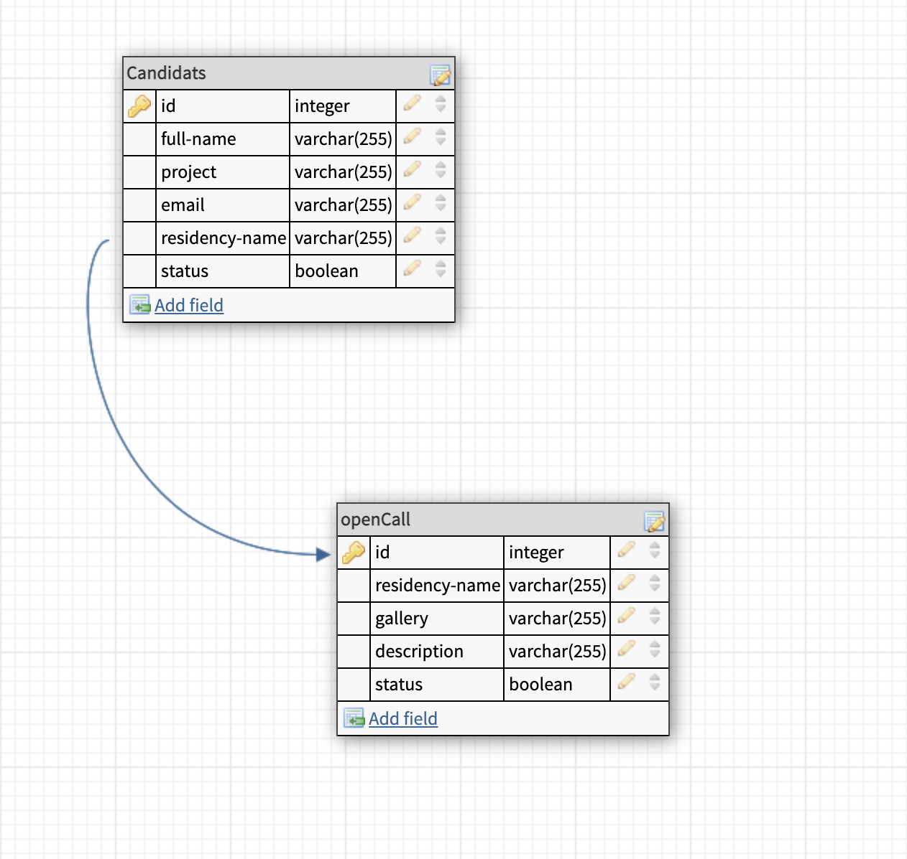
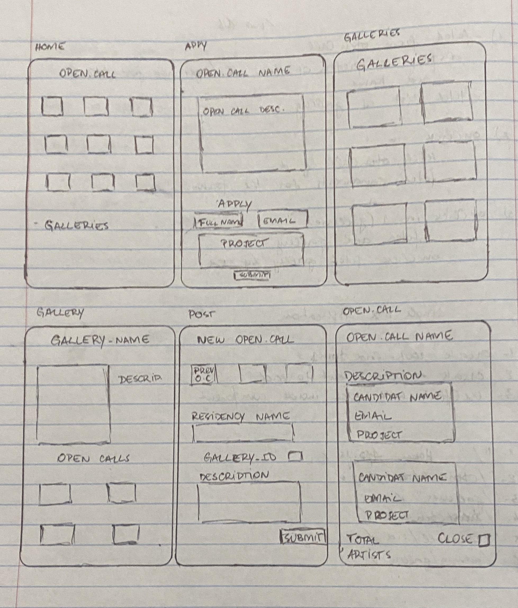

# open-call-application

To fulfill the needs of a group of independent galleries, I created an end-to-end app with responsive design in the Front-end (using React, ReactRouter, Bootstrap) and Back-end (Node.js/Express). All the data needed to make this app useful (Artists, Galleries and Open-call informations) was stored in a MySQL database that I created from scratch.

## Setup

### Dependencies

- Run `npm install` in project directory. This will install server-related dependencies such as `express`.
- `cd client` and run `npm install`. This will install client dependencies (React).

### Database Prep

- Access the MySQL interface in your terminal by running `mysql -u root -p`
- Create a new database called facebook: `create database residents`
- Add a `.env` file to the project folder of this repository containing the MySQL authentication information for MySQL user. For example:

```bash
  DB_HOST=localhost
  DB_USER=root
  DB_NAME=residents
  DB_PASS=YOURPASSWORD
  SUPER_SECRET=shhhhhh
```

- Run `npm run migrate` in the project folder of this repository, in a new terminal window. This will create 2 tables called 'candidats' and 'open-call' in your database.

- In your MySQL console, you can run `use residents;` and then `describe candidats;` to see the structure of the candidats table. Same thing for the 'open-call' and 'gallery'tables. This is a description of the tables:


IMPORTANT: the foreign key on the guide it's just to know how the tables are connect, but in the project ww will be using the JOIN tables.

Here are the API routes (for the BE)

- [API routes](https://docs.google.com/document/d/1uCJKWCHU2NAHr1hqVMKX6w5qcrjEZEmJrp3aHFBxYEU/edit?usp=sharing)

## FE COMPONENTS

This is a basic ideia of the components / pages


### Development

- Run `npm start` in project directory to start the Express server on port 5000
- In another terminal, do `cd client` and run `npm start` to start the client in development mode with hot reloading in port 3000.

## NEXT STEPS

- Accept a file as an input
- Allow the gallery to post images in their pages
- Add functionality to the open/close open call buttons (/opencall/:id) in the FE
- Change the status of the candidat application
- Send a message after submitting an application and a new open call

_This is a student project that was created at [CodeOp](http://codeop.tech), a full stack development bootcamp in Barcelona._
