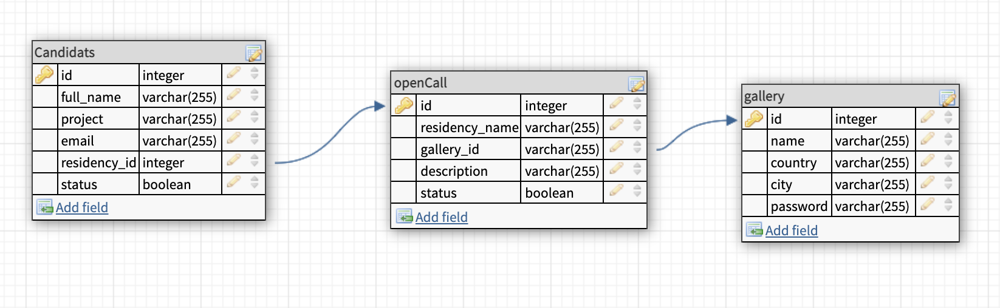

# open-call-application

This application allow you to upload different open-calls and allow the users to apply to them. It was done using React, Node/Express and MySQL.

## Setup

### Dependencies

- Run `npm install` in project directory. This will install server-related dependencies such as `express`.
- `cd client` and run `npm install`. This will install client dependencies (React).

### Database Prep

- Access the MySQL interface in your terminal by running `mysql -u root -p`
- Create a new database called facebook: `create database residents`
- Add a `.env` file to the project folder of this repository containing the MySQL authentication information for MySQL user. For example:

```bash
  DB_HOST=localhost
  DB_USER=root
  DB_NAME=residents
  DB_PASS=YOURPASSWORD
```

- Run `npm run migrate` in the project folder of this repository, in a new terminal window. This will create 2 tables called 'candidats' and 'open-call' in your database.

- In your MySQL console, you can run `use residents;` and then `describe candidats;` to see the structure of the candidats table. Same thing for the 'open-call'table. This is a description of the tables:



This is a basic ideia of the components / pages


Here are the API routes (for the BE)

- [API routes](https://docs.google.com/document/d/1uCJKWCHU2NAHr1hqVMKX6w5qcrjEZEmJrp3aHFBxYEU/edit?usp=sharing)

### Development

- Run `npm start` in project directory to start the Express server on port 5000
- In another terminal, do `cd client` and run `npm start` to start the client in development mode with hot reloading in port 3000.

## NEXT STEPS

- Create an authentication for the gallery user
- Accept a file as an input
- Allow the gallery to post images in their pages
- Add functionality to the open/close open call buttons (/opencall/:id) in the FE
- Create a way to change the status of the candidat application
- Send a message after submitting an application and a new open call

_This is a student project that was created at [CodeOp](http://codeop.tech), a full stack development bootcamp in Barcelona._
